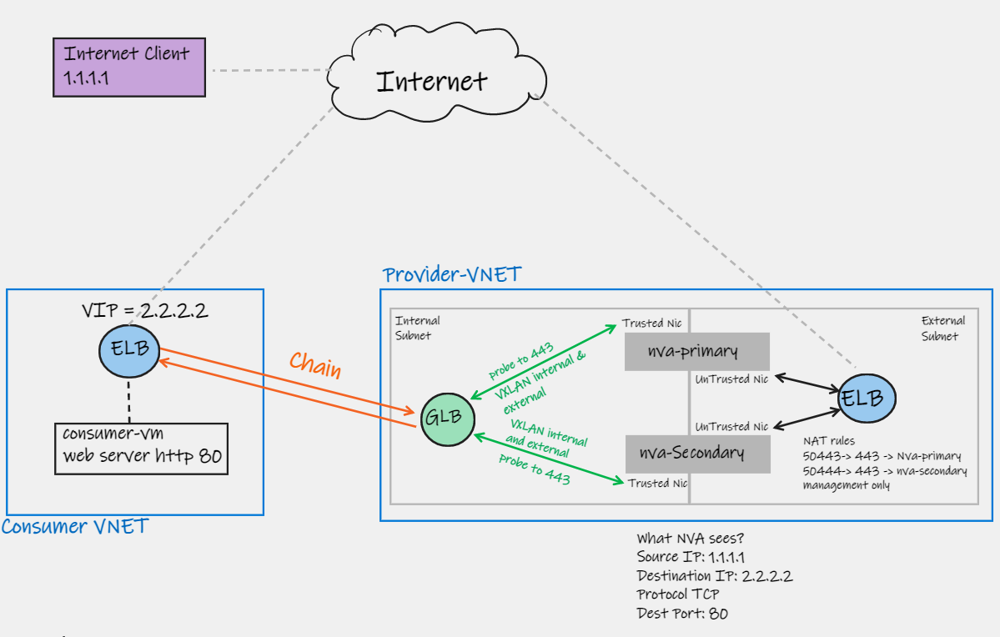
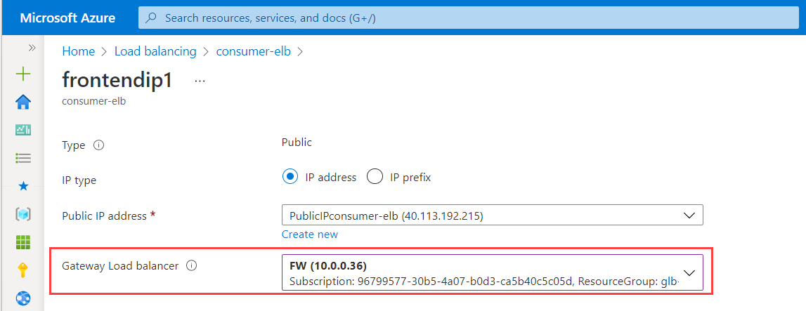
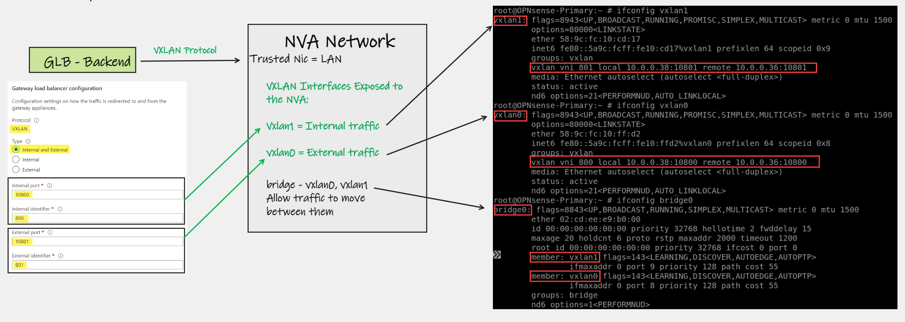
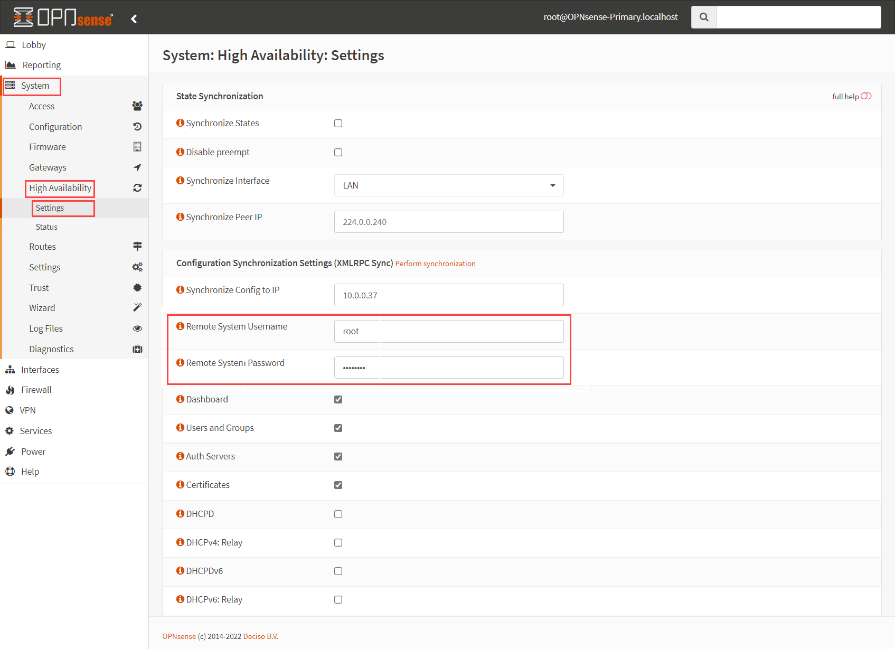
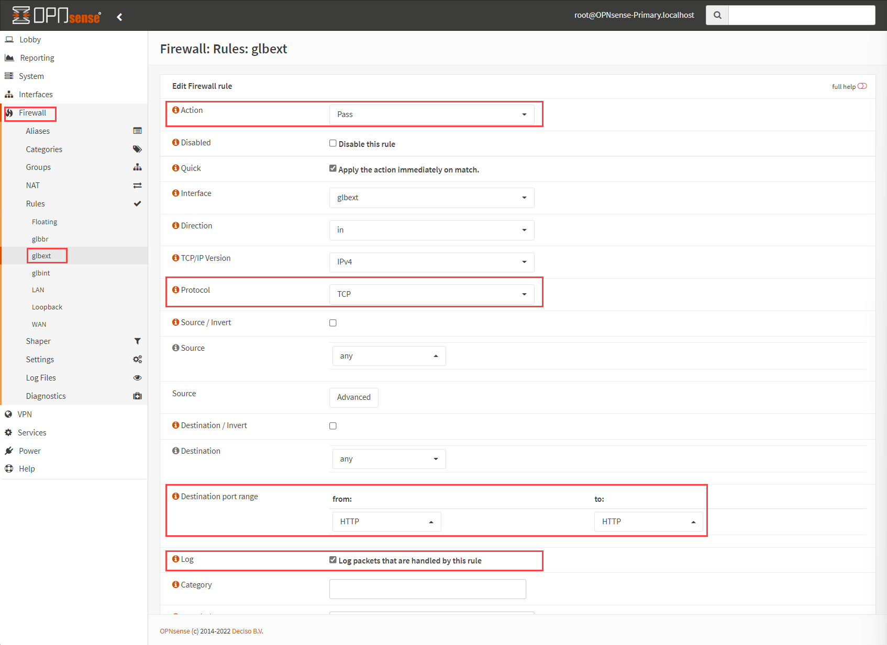
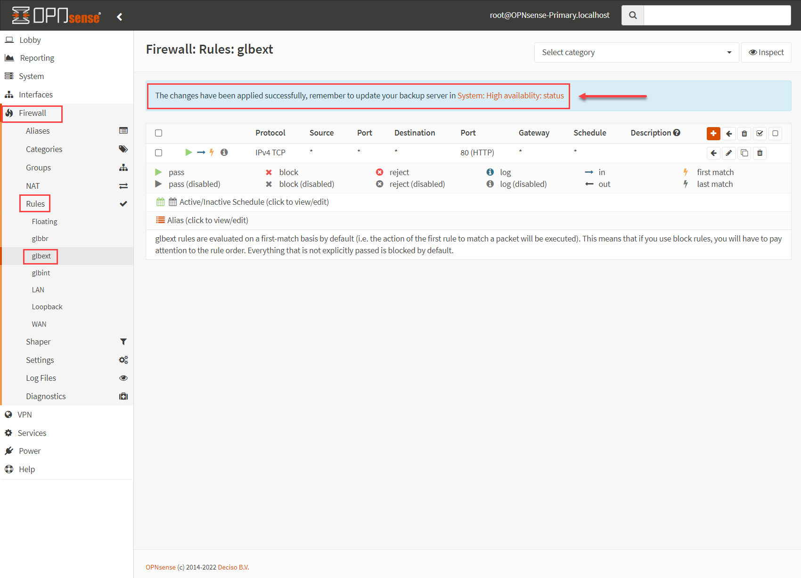
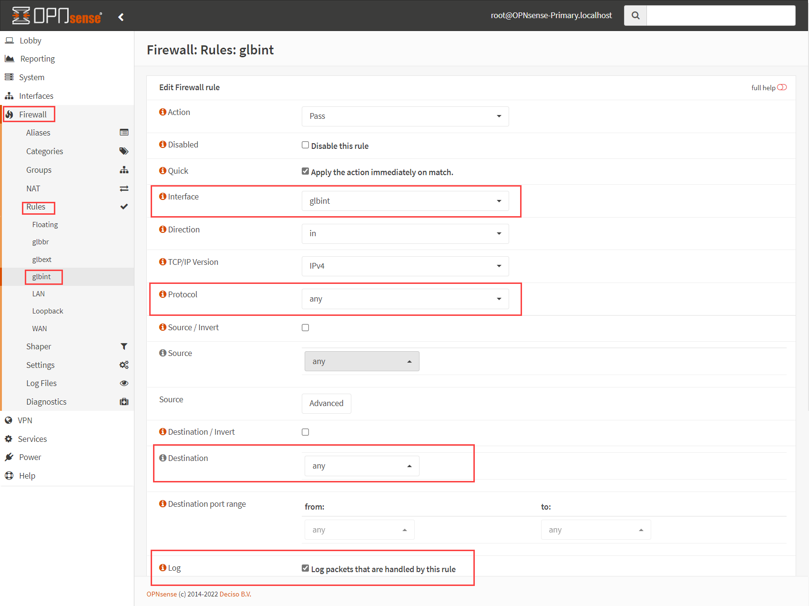
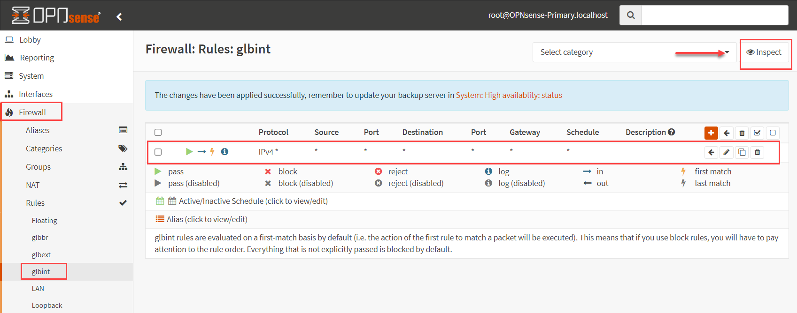
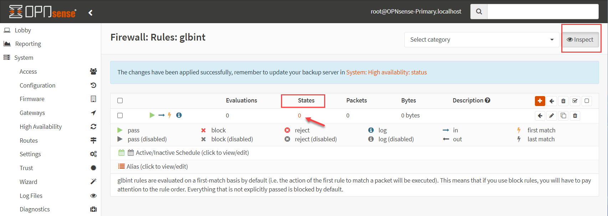
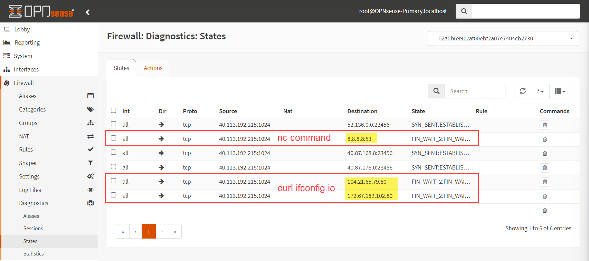

# Azure Gateway Load Balancer (Lab)

**In this article**

- [Introduction](#introduction)
- [Prerequisites](#prerequisites)
    - [Environment variables table](#required-environment-variables)
    - [Quick start](#quick-start)
- [What gets deployed](#what-gets-deployed)
- [Network diagram](#lab-network-diagram)
    - [Components and traffic flow](#components-and-traffic-flow)
    - [Considerations](#considerations)
- [ARM Template](#arm-template)
- [Deploy this solution](#deploy-this-solution)
    - [Prerequisites](#lab-prerequisites)
    - [Consumer](#consumer)
    - [Provider](#provider)
- [Validation walkthrough](#validation-walkthrough)
- [Traffic inspection](#traffic-inspection)
    - [Layer 4](#layer-4-firewall)
    - [Layer 7](#layer-7-inspection)
    - [IDS](#intrusion-detection-ids)
- [Known constraints](#known-constraints)
- [Cleanup](#cleanup)
- [Troubleshooting](./docs/troubleshooting.md)
- [Architecture decisions](./docs/architecture/)
    - [Trusted Launch](./docs/architecture/trusted-launch.md)
    - [Cloud-init migration](./docs/architecture/cloud-init-migration.md)
- [FreeBSD on Azure](./docs/troubleshooting-freebsd-on-azure.md)

## Introduction

The goal of this lab is to allow you to play with Gateway Load Balancer (GLB) and some of its capabilities. We will also spend some time explaining the under the hood components such as VXLAN that make GLB promising by making the NVA placement easier to implement in some scenarios. 

As part of the lab provisioning, two environments will be created. One is the consumer, with a simple web application exposed over an external (public) load balancer, and another for the provider using an NVA, who will be responsible for the traffic inspection.

GLB will be using a pair of open-source OPNsense NVAs as its backend, and we will explore some basic filtering capabilities initially and other advanced capabilities like IDS.

**Note:** for more information on OPNsense provisioning in Azure, check a dedicated repo with some other deployments: [OPNSense in Azure using bootstrap](https://github.com/dmauser/opnazure)

We assume you have some basic knowledge of what GLB is. If not, below are some references to bring you up to the speed on GLB:

- **Microsoft Docs:** [Gateway Load Balancer](https://learn.microsoft.com/azure/load-balancer/gateway-overview)
- **Azure Blog:** [Enhance third-party NVA availability with Azure Gateway Load Balancer—now in preview](https://azure.microsoft.com/en-us/blog/enhance-thirdparty-nva-availability-with-azure-gateway-load-balancer-now-in-preview/) - This article also goes over vendor-specific supportability for GLB
- **John Savill's video**: [Azure Gateway Load Balancer Deep Dive](https://www.youtube.com/watch?v=JLx7ZFzjdSs)
- **Jose Moreno's deep dive article:** [What language does the Azure Gateway Load Balancer speak?](https://blog.cloudtrooper.net/2021/11/11/what-language-does-the-azure-gateway-load-balancer-speak/)

## Prerequisites

### System Requirements

- Azure subscription with sufficient quota for: 4 VMs, 3 Public IPs, 2 Load Balancers
- Azure CLI installed and logged in (`az login`)
- Bicep CLI (the script auto-installs if missing)
- A strong, unique password for the consumer VM admin account (prompted interactively; see [env-vars table](#required-environment-variables))

### Required environment variables

| Name | Required | Default | Description |
|------|----------|---------|-------------|
| `ADMIN_PASSWORD` | no | *(prompt)* | Admin password for the consumer VM. If not set, `deploy.azcli` prompts interactively with hidden input and confirmation. Azure requires 12-72 chars with uppercase, lowercase, digit, and special character. Set in advance for CI/scripted runs. |
| `SUBSCRIPTION_ID` | no | current | Azure subscription ID to deploy to; switches context before deploy |
| `LOCATION` | no | `westus2` | Azure region for all resources |
| `RG_CONSUMER` | no | `glb-consumer-rg` | Consumer resource group name |
| `RG_PROVIDER` | no | `glb-provider-rg` | Provider resource group name |
| `ADMIN_USERNAME` | no | `azureuser` | VM admin username (consumer and provider) |
| `BASTION_DEPLOY` | no | `false` | Set `true` to deploy Azure Bastion in both resource groups |
| `OPN_BOOTSTRAP_URI` | no | `https://raw.githubusercontent.com/dmauser/azure-gateway-lb/main/scripts/` | Base URI (with trailing slash) for `configureopnsense.sh` — cloud-init fetches from this URL at first boot. **Must point to a public ref containing your latest script changes.** |
| `SSH_PUBLIC_KEY` | no | — | [Debug/optional] SSH public key for post-deploy access to the consumer VM via `ssh`. Not required for deployment. |

> ⚠️ **Marketplace terms:** `thefreebsdfoundation/freebsd-14_4` requires `az vm image terms accept` on each subscription before first deploy. `deploy.azcli` handles this automatically, but some Enterprise Agreement (EA) and CSP subscriptions have policies that prevent third-party marketplace acceptance — contact your Azure administrator if terms acceptance fails.

> ⚠️ **`OPN_BOOTSTRAP_URI` must point to pushed code:** The OPNsense NVA VMs fetch `configureopnsense.sh` from this URL at first boot. If you have local changes that haven't been pushed, set `OPN_BOOTSTRAP_URI` to point to your pushed branch before running `deploy.azcli`.

### Quick start

```bash
bash deploy.azcli
# You will be prompted: Enter admin password for consumer VM (12-72 chars, complex):
```

For non-interactive / CI runs, set `ADMIN_PASSWORD` before running:

```bash
ADMIN_PASSWORD='MyP@ssw0rd!' bash deploy.azcli
```

> **Note:** If you have local changes to `scripts/configureopnsense.sh` that haven't been pushed yet, set `OPN_BOOTSTRAP_URI` to a pushed branch:
> ```bash
> export OPN_BOOTSTRAP_URI="https://raw.githubusercontent.com/dmauser/azure-gateway-lb/<your-branch>/scripts/"
> ```

> **Note:** `main-two-nics.bicep` (single-NVA, two-NIC topology) is archived under `archived/` and is no longer maintained. The canonical deployment is the active-active topology (`bicep/glb-active-active.bicep`).

---

## What Gets Deployed

Running `bash deploy.azcli` creates the following resources:

### Consumer resource group (`$RG_CONSUMER`, default: `glb-consumer-rg`)

| Resource | Type | Details |
|----------|------|---------|
| `consumer-vnet` | Virtual Network | `10.0.0.0/24` with `vmsubnet` (`/27`) and optional `AzureBastionSubnet` (`/27`) |
| `consumer-nsg` | NSG | Allows SSH and HTTP inbound |
| `consumer-elb-pip` | Public IP | Standard, Static — the consumer ELB public-facing IP |
| `consumer-elb` | External Load Balancer | Standard SKU; HTTP (port 80) rule + health probe; SSH NAT rule (50000→22) |
| `consumer-vm` | Ubuntu 22.04 Gen2 VM | Trusted Launch (Secure Boot + vTPM); nginx via cloud-init |
| `consumer-bastion` | Azure Bastion (optional) | Deployed when `BASTION_DEPLOY=true` |

### Provider resource group (`$RG_PROVIDER`, default: `glb-provider-rg`)

| Resource | Type | Details |
|----------|------|---------|
| `provider-vnet` | Virtual Network | `10.0.0.0/24` with `external` (`/27`), `internal` (`/27`), optional `AzureBastionSubnet` (`/27`) |
| `provider-nva-glb` | Gateway Load Balancer | HA Ports rule; VXLAN backend (UDP 10800/10801, VNI 800/801); TCP 443 health probe |
| `provider-nva-elb` | External Load Balancer (management) | NAT rules: 50443→443 (primary), 50444→443 (secondary) |
| `provider-nva-elb-pip` | Public IP | Management access to OPNsense web UI |
| `provider-nva-primary` | FreeBSD 14.4 Gen2 VM | OPNsense NVA (no Trusted Launch — platform constraint); bootstrapped via cloud-init |
| `provider-nva-secondary` | FreeBSD 14.4 Gen2 VM | Same as primary; VXLAN peer |
| `provider-bastion` | Azure Bastion (optional) | Deployed when `BASTION_DEPLOY=true` |

**GLB chain:** After both sides deploy, `deploy.azcli` links `consumer-elb` frontend (`frontendip1`) to `provider-nva-glb` frontend (`FW`). All traffic through the consumer ELB is redirected to OPNsense for inspection.

## Lab Network diagram

The network diagram below gives you a visualization of the components involved in this lab:



### Components and traffic flow

#### Consumer side

- Consumer-vnet (/24) with two subnets: vmsubnet (/27), and AzureBastionSubnet (/27).
- Consumer-elb (External Public Load Balancer).
    - Load Balancer rule to TCP 80 (HTTP).
    - Probe to port 80.
    - Inbound NAT Rule 50000 to 22 (SSH) to access consumer-vm.
    - Backend Pool: consumer-vm.
- Consumer-vm running Ubuntu/NGINX (From internet client you can run: curl Consumer-elb Public IP and you should get output: _Test Website on consumer-vm_)
- Consumer-bastion (optional)

#### Provider side
- Provider-vnet (/24) with three subnets: external (/27), internal (/27), and AzureBastionSubnet (/27)
- Provider-nva-glb - Gateway Load Balancer with backend pool with traffic towards NVAs.
    - Load balancer :  HA Port (All/0).
    - Backend Pool to both Provider-nva-primary and Provider-nva-secondary.
        - Protocol: VLXAN 
        - Type: Internal/External
        - Internal port: 10800
        - Internal identifier: 800
        - External port: 10801
        - External identifier: 801
    - Health Probe: TCP 443.
- Provider-nva-elb - This is an external load balancer used only for management:
    - Inbound NAT rule: 50443 to 443 (Provider-nva-primary)
    - Inbound NAT rule: 50444 to 443 (Provider-nva-secondary)
- Provider-nva-primary
- Provider-nva-secondary
- Provider-bastion (optional)
- provider-win11 (optional)

#### Traffic flow

**Inbound traffic**

1) Internet client (1.1.1.1) issues a http request to 2.2.2.2
2) Consumer ELB intercepts that traffic and forwards it to the Provider GLB. That is possible because Consumer ELB has a chain to the Provider ELB. Example:

3) Provider GLB has a VXLAN overlay network to the NVA to be inspected. _Vxlan0 interface for the external traffic (Inbound from the Internet)_.
4) After traffic gets inspected from NVA, traffic is sent back to the GLB. _Vxlan1 interface for the internal traffic_ (Outbound to the Consumer ELB).
5) Provider GLB sends traffic back to the Consumer ELB.
6) Consumer ELB delivers traffic back to the backend VM (consumer-vm).

**Outbound traffic**

1) Consumer-vm sends outbound traffic to the Internet, for example: _curl ipconfig.io_
2) Consumer ELB intercepts the call and sends traffic to the Provider GLB.
3) Provider GLB sends traffic to the NVA using _vxlan1 (internal)_.
4) After traffic gets inspected by the NVA, it sends it back to the Provider GLB using _vxlan0 (external)_.
5) Provider GLB sends traffic back to the ELB and then sends it out to the Internet.

#### Inside VXLAN between GLB and backend NVA

Here are some details how that VXLAN overlay is built for internal and external traffic.



### Considerations

- Consumer and Provider can be in different Azure Subscriptions or tenants.
- At this time only External (Public) LB is supported to chain to the Gateway LB. Therefore, only North-South/South-North traffic patterns are supported.

## ARM Template

Before going over all the lab steps, you can deploy the provider side of this solution in your environment using an ARM template and the "Deploy to Azure" button. The available template below assumes that you have an existing Virtual Network (VNET) and at least two subnets: Untrusted (or External) and Trusted (or Internal).
If you deploy the provider side using that template, you will not need to go through steps of the provider unless you want to deploy Azure Bastion.

[](https://portal.azure.com/#create/Microsoft.Template/uri/https%3A%2F%2Fraw.githubusercontent.com%2Fdmauser%2Fazure-gateway-lb%2Fmain%2Fbicep%2Fglb-active-active.json)
[](http://armviz.io/#/?load=https%3A%2F%2Fraw.githubusercontent.com%2Fdmauser%2Fazure-gateway-lb%2Fmain%2Fbicep%2Fglb-active-active.json)

Also review the [Considerations after provisioning provider NVAs:](#considerations-after-provisioning-provider-nvas) to properly access and managed provisioned NVAs.

## Deploy this solution

In this lab, you will deploy the Consumer and Provider in totally different networks. In this demonstration, both networks use the same address range (10.0.0.0/24) to prove that the GLB model provider side, where the traffic inspection happens, is separated from the consumer side from a networking perspective (no VNET peerings between them or connections between them). You can also deploy both Consumer and Provider in the same Subscription or separated Subscription/Tenants and build the chain between them.

:point_right: **Note:** The commands below use the bash variables format. Therefore, run them over Linux with Azure CLI or Azure Cloud Shell Bash. Variables will fail over AZ CLI in PowerShell or windows command prompt.

### Lab prerequisites

Deploy this solution by using **Azure CLI** or **Cloud Shell Bash**.

```Bash
az login
#List all your subscriptions
az account list -o table --query "[].{Name:name, IsDefault:isDefault}"
#List default Subscription being used
az account list --query "[?isDefault == \`true\`].{Name:name, IsDefault:isDefault}" -o table

# In case you want to do it separated Subscription change your active subscription as shown
az account set --subscription <Add your Subscription Name or ID>  # Change as needed
```

### Consumer

Define variables based on your requirements.

```bash
consumer_rg=glb-lab
consumer_location=centralus
consumervnetcidr="10.0.0.0/24"
consumersubnet="10.0.0.0/27"
consumerbastionsubnet="10.0.0.32/27"
mypip=$(curl -4 ifconfig.io -s) # or replace with your home public ip, example mypip="1.1.1.1" (required for Cloud Shell deployments)
echo "Type username and password"
read -p 'Username: ' username && read -sp 'Password: ' password 
```

Run Steps below from 1 to 6 or 7 (Bastion is optional):

```bash
# 1) Create Consumer VNET and subnet
az group create --name $consumer_rg --location $consumer_location --output none
az network vnet create --resource-group $consumer_rg --name consumer-vnet --location $consumer_location --address-prefixes $consumervnetcidr --subnet-name vmsubnet --subnet-prefix $consumersubnet --output none

# 2) NSG to restrict SSH access to Azure VMs from your Public IP only:
az network nsg create --resource-group $consumer_rg --name consumer-nsg --location $consumer_location
az network nsg rule create \
    --resource-group $consumer_rg \
    --nsg-name consumer-nsg \
    --name AllowSSHRule \
    --direction Inbound \
    --priority 100 \
    --source-address-prefixes $mypip/32 \
    --source-port-ranges '*' \
    --destination-address-prefixes '*' \
    --destination-port-ranges 22 \
    --access Allow \
    --protocol Tcp \
    --description "Allow inbound SSH" \
    --output none
az network nsg rule create \
    --resource-group $consumer_rg \
    --nsg-name consumer-nsg \
    --name allow-http \
    --direction Inbound \
    --priority  101 \
    --source-address-prefixes '*' \
    --source-port-ranges '*' \
    --destination-address-prefixes '*' \
    --destination-port-ranges 80 \
    --access Allow \
    --protocol Tcp \
    --description "Allow inbound HTTP" \
    --output none
az network vnet subnet update --name vmsubnet --resource-group $consumer_rg --vnet-name consumer-vnet --network-security-group consumer-nsg --output none

# 3) Create Public Load Balancer
az network lb create -g $consumer_rg --name consumer-elb --sku Standard --frontend-ip-name frontendip1 --backend-pool-name vmbackend --output none
az network lb probe create -g $consumer_rg --lb-name consumer-elb --name httpprobe --protocol tcp --port 80 --output none
az network lb rule create -g $consumer_rg --lb-name consumer-elb --name http-lb-rule --protocol TCP --frontend-ip-name frontendip1 --backend-pool-name vmbackend --probe-name httpprobe --frontend-port 80 --backend-port 80 --output none
az network lb inbound-nat-rule create -g $consumer_rg --lb-name consumer-elb -n sshnat --protocol Tcp --frontend-port 50000 --backend-port 22

# 4) Deploy Azure VM with NGINX using a simple test Website
az network nic create --resource-group $consumer_rg -n consumer-vm-nic --location $consumer_location --subnet vmsubnet --vnet-name consumer-vnet --output none
az vm create -n consumer-vm -g $consumer_rg --image Ubuntu2204 --size Standard_B1s --admin-username $username --admin-password $password --nics consumer-vm-nic --no-wait --location $consumer_location --output none

# ) Attach VM to LB Rule and NAT Rule
az network nic ip-config address-pool add --address-pool vmbackend --ip-config-name ipconfig1 --nic-name consumer-vm-nic --resource-group $consumer_rg --lb-name consumer-elb --output none
az network nic ip-config inbound-nat-rule add --inbound-nat-rule sshnat --ip-config-name ipconfig1 --nic-name consumer-vm-nic --resource-group $consumer_rg --lb-name consumer-elb --output none

# 6) Install nginx and test website (Move this to cloud.init)
az vm extension set --resource-group $consumer_rg --vm-name consumer-vm --name CustomScript --settings '{"commandToExecute": "apt-get -y update && apt-get -y install nginx && echo Test Website on consumer-vm > /var/www/html/index.html"}' --publisher Microsoft.Azure.Extensions --no-wait

# 7) Deploy Bastion (Optional)
az network vnet subnet create --resource-group $consumer_rg --name AzureBastionSubnet --vnet-name consumer-vnet --address-prefixes $consumerbastionsubnet --output none
az network public-ip create --resource-group $consumer_rg --name consumer-bastion-pip --sku Standard --location $consumer_location
az network bastion create --name consumer-bastion --sku basic  --public-ip-address consumer-bastion-pip --resource-group $consumer_rg --vnet-name consumer-vnet --location $consumer_location
```

### Provider

You can provision both Consumer and Provider in the same Azure subscription. In case you want to do both environments separated, your can set separated subscriptions as shown below:

```bash
az login
#List all your subscriptions
az account list -o table --query "[].{Name:name, IsDefault:isDefault}"
#List default Subscription being used
az account list --query "[?isDefault == \`true\`].{Name:name, IsDefault:isDefault}" -o table
az account set --subscription <Add your Subscription Name or ID>  # Change as needed
```

Set variables and make changes based on your needs.

```bash
provider_rg=glb-lab
provider_location=centralus
providervnetcidr="10.0.0.0/24"
providerexternalcidr="10.0.0.0/27"
providerinternalcidr="10.0.0.32/27"
providerbastionsubnet="10.0.0.64/27"
nva=provider-nva
mypip=$(curl -4 ifconfig.io -s) # or replace with your home public ip, example mypip="1.1.1.1" (required for Cloud Shell deployments)
```

Run Steps 1 and 2. Step 3 deploys Bastion, and it is optional:

```bash
# 1) Create provider VNET and Internal/External 
az group create --name $provider_rg --location $provider_location --output none
az network vnet create --resource-group $provider_rg --name provider-vnet --location $provider_location --address-prefixes $providervnetcidr --subnet-name external --subnet-prefix $providerexternalcidr --output none
az network vnet subnet create --name internal --resource-group $provider_rg --vnet-name provider-vnet --address-prefix $providerinternalcidr --output none

# 2) Deploy both OPNsense NVA (work on this)
az deployment group create --name $nva-deploy-$RANDOM --resource-group $provider_rg \
--template-uri "https://raw.githubusercontent.com/dmauser/azure-gateway-lb/main/bicep/glb-active-active.json" \
--parameters virtualMachineSize=Standard_B2s virtualMachineName=$nva TempUsername=azureuser TempPassword=Msft123Msft123 existingVirtualNetworkName=provider-vnet existingUntrustedSubnet=external existingTrustedSubnet=internal PublicIPAddressSku=Standard \
--no-wait

# 3) Deploy Bastion (Optional) - You can access OPNSense by SSH via Bastion to perform troubleshooting.
az network vnet subnet create --resource-group $provider_rg --name AzureBastionSubnet --vnet-name provider-vnet --address-prefixes $providerbastionsubnet --output none
az network public-ip create --resource-group $provider_rg --name provider-bastion-pip --sku Standard --location $provider_location --output none
az network bastion create --name provider-bastion --sku basic  --public-ip-address provider-bastion-pip --resource-group $provider_rg --vnet-name provider-vnet --location $provider_location
```

#### Considerations after provisioning provider NVAs

1. Password specified above is only used during deployment.
2. After the deployment completes, you can access OPNsense by using provider-nva-elb Public IP on port 50443 (first instance), 50444 (secondary instance). Although is recommended to manage primary instance and sync configuration with the secondary NVA (see item 4)
    ```bash
    # Get provider-nva-elb Public IP to manage both instances
    az network public-ip show -g $provider_rg --name provider-nva-elb-pip --query ipAddress -o tsv
    ```
3. It is recommended you manage only primary and synchronize configuration with secondary.
4. Default username is: **root** and default password is: **opnsense** (**Please change the password**).
    - Because the deployment is made in HA (primary and secondary) NVAs, make sure to change the HA Configuration Synchronization Settings password too.
    

### Validate Deployment

#### Test connectivity to consumer-vm via its ELB

After deployment is ready, you don't have the traffic going to the provider yet. You have to build the chain between the consumer-elb to the provider-nva-glb. See next [section](#build-a-chain-between-consumer-elb-and-provider-nva-glb) for more details.

To ensure everything is fine, you can run the following commands to test the connectivity. You can use the following tools:

```bash
# Subscription where Consumer is (required only if consumer is on different subscription)
az account set --subscription <consumer subscription>  # Change to your subscription name

# Get consumer-elb public ip as variable.
consumerelbpip=$(az network public-ip show -g $consumer_rg --name PublicIPconsumer-elb --query ipAddress -o tsv)
echo $consumerelbpip

# Use the output below to run your connectivity tests. 
# It requires psping.exe from PSTools SysInternal
# Tests on Windows 
echo psping -t $consumerelbpip:80 
echo psping -t $consumerelbpip:50000
# Run output on windows command line.psp

# Use Linux (it requires nmap and hping3 packages)
sudo hping3 $consumerelbpip -S -p 50000
sudo nping --tcp $consumerelbpip -p 80 -c 50000
nc -v -z $consumerelbpip 80
# output: Connection to 40.113.192.215 80 port [tcp/http] succeeded!
curl $consumerelbpip
# output: Test Website on consumer-vm
```

#### Build a chain between consumer-elb and provider-nva-glb

Leave one of the connectivity tests running above while chaining the consumer-elb to the provider-nva-glb.
The commands below work for consumer and provider in the same or different subscriptions (Azure Portal only works for the same subscription):

```bash
# Check what is the current active subscription
az account list --query "[?isDefault == \`true\`].{Name:name, IsDefault:isDefault}" -o table
# Subscription where Provider (required only if provider is on different subscription)
az account set --subscription <provider subscription>  # Change to your subscription name
# Set Gateway Load Balancer (provider-nva-glb) frontend name resource ID as variable 
glbfeid=$(az network lb frontend-ip show -g $provider_rg --lb-name provider-nva-glb --name FW --query id --output tsv)
echo $glbfeid

# Subscription where Consumer is (required only if consumer is on different subscription)
az account set --subscription <consumer subscription>  # Change to your subscription name
# Add chain between consumer-elb and provider-nva-glb
az network lb frontend-ip update -g $consumer_rg --name frontendip1 --lb-name consumer-elb --public-ip-address PublicIPconsumer-elb --gateway-lb $glbfeid --output none

# Validate chain between consumer-elb and provider-nva-glb
az network lb frontend-ip show -g $consumer_rg --name frontendip1 --lb-name consumer-elb --query gatewayLoadBalancer.id -o tsv
# In case you see a resource ID it there's a chain between consumer-elb and provider-nva-glb.
# Otherwise, empty output means there's no chain.

# Remove chain between consumer-elb and provider-nva-glb
az network lb frontend-ip update -g $consumer_rg --name frontendip1 --lb-name consumer-elb --public-ip-address PublicIPconsumer-elb --gateway-lb "" --output none
```

On the process above by adding the chain between consumer-elb and provider-nva-glb your running connectivity test should stop because there's no Firewall rule to allow traffic on the NVA. You should see a transition to disconnection as shown:

```bash
#PSping to consumer-elb public IP using port 80.
psping -t 40.113.192.215:80 

#output
Connecting to 40.113.192.215:80: from 192.168.68.93:50642: 23.20ms
Connecting to 40.113.192.215:80: from 192.168.68.93:50644: 22.97ms
Connecting to 40.113.192.215:80: from 192.168.68.93:50646: 24.06ms
Connecting to 40.113.192.215:80: from 192.168.68.93:50647: 23.41ms
Connecting to 40.113.192.215:80: from 0.0.0.0:50648:
This operation returned because the timeout period expired.
Connecting to 40.113.192.215:80: from 0.0.0.0:50650:
This operation returned because the timeout period expired.
Connecting to 40.113.192.215:80: from 0.0.0.0:50652:
This operation returned because the timeout period expired.
Connecting to 40.113.192.215:80: from 0.0.0.0:50653:
This operation returned because the timeout period expired.
```

## Traffic inspection

In this section, we will explore some firewall features for traffic inspection using OPNSense Firewall over different scenarios. Let's start with simple firewall rules to allow traffic and move over other firewall capabilities such as IPDS, Proxy, DDoS protection.

### Layer 4 (Firewall)

To begin, a simple firewall rule we will cover two traffic flows. The first one is for inbound traffic, which will simulate an internet client sending an HTTP request or probe to TCP 80, by reaching the website hosted in the consumer-vm behind the ELB which is chained to the GLB, and get the traffic inspected by the OPNsense NVAs.

The second scenario is for the customer-vm initiating an outbound call to get the reverse-path inspected.

#### Inbound Traffic

1. Create a Firewall Rule under glbext (external vxlan0 interface) to allow traffic to port 80. By enabling logging on the same rule, you can see the traffic over Firewall - Log Files - Live View.

2. Make sure to apply changes and synchronize with settings with provider-nva-secondary by clicking on System: High Availability: Status and clicking in sync. (Note: you can also shut down one of the NVAs if you want to avoid sync whenever you make a change. You can resync later to commit the changes to the secondary).

3. Issue a psping/nping/hping or even curl against the Public IP of the consumer-ELB to validate the connectivity. If you have a check for port 50000, it should still see failure because the rule above has been open only for TCP 80 (HTTP).
	```bash
    # Get consumer-elb public ip as variable.
    consumerelbpip=$(az network public-ip show -g $consumer_rg --name PublicIPconsumer-elb --query ipAddress -o tsv)
    echo $consumerelbpip
    # Use the output below to run your connectivity tests. 
    #Tests on Windows 
    echo psping -t $consumerelbpip:80 
    echo psping -t $consumerelbpip:50000
    # Run output on windows command line.

    # Use Linux (it requires nmap and hping3 packages)
    sudo hping3 $consumerelbpip -S -p 50000
    sudo nping --tcp $consumerelbpip -p 80 -c 50000
    nc -v -z $consumerelbpip 80
    # output: Connection to 40.113.192.215 80 port [tcp/http] succeeded!
    curl $consumerelbpip
    # output: Test Website on consumer-vm
    ```
4. Play with the firewall rules as you whish by restricting to source and destination. Also check the logs.

#### Outbound Traffic

1. Access the consumer-vm via Bastion and try to make an outbound call to the Internet, such as: __curl ifconfig.io__ or __nc -v -z 8.8.8.8 53__. The expectation is the connectivity should fail.
    ```bash
    consumer-vm:~$ curl ifconfig.io
    curl: (7) Failed to connect to ifconfig.io port 80: Connection timed out
    
    consumer-vm:~$ nc -v -z 8.8.8.8 53
    nc: connect to 8.8.8.8 port 53 (tcp) failed: Connection timed out
    ```
2. Create a Firewall rule under glbint (internal vxlan1 interface) to allow outbound traffic as shown:

3. Re-run the same commands __curl ifconfig.io__ or __nc -v -z 8.8.8.8 53__ and check now if you have connectivity.

    ```bash
    consumer-vm:~$ curl ifconfig.io
    40.113.192.215
    
    consumer-vm:~$ nc -v -z 8.8.8.8 53
    Connection to 8.8.8.8 53 port [tcp/domain] succeeded!
    ```
4. Play with the firewall rules as you whish by restricting to source and destination. Also check the logs, for example by hitting inspect over the rule and you should get all the traffic going over the rule created.




    **Bonus**: nslookup ifconfig.io confirms the target IPs used by curl and showed obove in the inspection:
    ```bash
    consumer-vm:~$ nslookup ifconfig.io
    Server:127.0.0.53
    Address:127.0.0.53#53

    Non-authoritative answer:
    Name:ifconfig.io
    Address: 172.67.189.102
    Name:ifconfig.io
    Address: 104.21.65.79
    ```

### Intrusion detection (IDS)

IDS (Intrusion Detection System) capabilities are available in OPNsense and can be configured to monitor traffic for suspicious patterns. For advanced IDS/IPS setup and threat detection, see [OPNsense IDS/IPS documentation](https://docs.opnsense.org/). This lab does not configure L7 IDS by default but provides the foundation to add this capability.

### Layer 7 inspection

Layer 7 (Application layer) inspection and filtering capabilities are available in OPNsense through its proxy and content filtering features. For advanced L7 filtering setup, see [OPNsense IDS/IPS docs](https://docs.opnsense.org/) for detailed configuration of HTTP/HTTPS inspection, DPI (Deep Packet Inspection), and application-layer threat detection. This lab does not configure L7 filtering by default but the GLB infrastructure supports adding these advanced inspection capabilities.

---

## Validation Walkthrough

This section answers: **"Did it work?"** Each step must pass before moving to the next.

### Step 1 — Consumer VM is running and nginx is healthy

```bash
# Check VM power state:
az vm get-instance-view \
    --resource-group "$RG_CONSUMER" \
    --name consumer-vm \
    --query 'instanceView.statuses[?code==`PowerState/running`]' \
    -o json
# Expected: one entry with "code": "PowerState/running"

# Verify nginx responds directly (no GLB chain yet):
consumer_pip=$(az network public-ip show \
    -g "$RG_CONSUMER" --name consumer-elb-pip --query ipAddress -o tsv)
curl http://$consumer_pip
# Expected: Test Website on consumer-vm
```

### Step 2 — Consumer VM Trusted Launch is active

```bash
az vm show \
    --resource-group "$RG_CONSUMER" \
    --name consumer-vm \
    --query 'securityProfile' \
    -o json
# Expected:
# {
#   "securityType": "TrustedLaunch",
#   "uefiSettings": { "secureBootEnabled": true, "vTpmEnabled": true }
# }
```

### Step 3 — Consumer cloud-init completed

```bash
# SSH into consumer-vm via ELB NAT rule (port 50000):
ssh azureuser@$consumer_pip -p 50000

# On the VM:
cloud-init status
# Expected: status: done

sudo cat /var/log/cloud-init-output.log | tail -20
# Expected: lines including "Setting up nginx" and cloud-init "finished" message
```

### Step 4 — OPNsense NVAs deployed (no Trusted Launch)

```bash
az vm show -g "$RG_PROVIDER" -n provider-nva-primary --query 'securityProfile' -o json
az vm show -g "$RG_PROVIDER" -n provider-nva-secondary --query 'securityProfile' -o json
# Expected: null (no securityProfile block — FreeBSD 14.4 platform constraint)
```

### Step 5 — OPNsense bootstrap succeeded on both NVAs

```bash
# SSH into primary NVA via Bastion (if deployed):
provider_elb_pip=$(az network public-ip show \
    -g "$RG_PROVIDER" --name provider-nva-elb-pip --query ipAddress -o tsv)
echo "Provider ELB PIP: $provider_elb_pip"
# Access OPNsense web UI at: https://$provider_elb_pip:50443 (primary)
#                             https://$provider_elb_pip:50444 (secondary)

# If Bastion is deployed, SSH to primary:
az network bastion ssh \
    --name provider-bastion \
    --resource-group "$RG_PROVIDER" \
    --target-resource-id "$(az vm show -g "$RG_PROVIDER" -n provider-nva-primary --query id -o tsv)" \
    --auth-type ssh-key \
    --username root \
    --ssh-key ~/.ssh/id_rsa

# On the NVA — check bootstrap sentinel:
cat /var/run/opnsense-bootstrap-done
# Expected: bootstrap-ok-<ISO8601Z timestamp>
# If absent: check /var/run/opnsense-bootstrap-failed and /var/log/opnsense-bootstrap.log

# Verify OPNsense config was applied:
grep -i hostname /usr/local/etc/config.xml
# Expected: OPNsense-Primary (or OPNsense-Secondary)
```

### Step 6 — GLB chain is established

```bash
az network lb frontend-ip show \
    -g "$RG_CONSUMER" \
    --lb-name consumer-elb \
    --name frontendip1 \
    --query gatewayLoadBalancer.id \
    -o tsv
# Expected: non-empty resource ID:
# /subscriptions/.../resourceGroups/glb-provider-rg/.../provider-nva-glb/frontendIPConfigurations/FW
# Empty output = chain not established; re-run GLB chain step from deploy.azcli
```

### Step 7 — VXLAN end-to-end proof (tcpdump)

> **This is the required validation.** An nginx HTTP response alone is not sufficient — it can succeed via direct routing if the GLB chain is bypassed. The tcpdump below proves traffic is encapsulated and flowing through the OPNsense VXLAN tunnel.

**Terminal 1 — Generate traffic continuously:**

```bash
consumer_pip=$(az network public-ip show \
    -g "$RG_CONSUMER" --name consumer-elb-pip --query ipAddress -o tsv)
while true; do curl -s http://$consumer_pip > /dev/null; sleep 1; done
```

**Terminal 2 — SSH into OPNsense primary NVA and capture VXLAN:**

```bash
# (SSH to NVA via Bastion or SSH NAT — see Step 5 above)

# Capture VXLAN encapsulated UDP traffic on any interface:
tcpdump -nn -i any "udp port 10800 or udp port 10801"
```

**Expected output (PASS):**

```
14:23:01.123456 IP 10.0.0.4.XXXXX > 10.0.0.36.10800: UDP, length 78
14:23:01.124001 IP 10.0.0.36.10801 > 10.0.0.4.XXXXX: UDP, length 78
```

Packets arriving on UDP 10800 (inbound VXLAN from GLB) and departing on UDP 10801 (outbound VXLAN
returning to GLB) confirm that traffic is being encapsulated and flowing through the NVA.

**Alternative — capture at the vxlan interface level:**

```bash
tcpdump -nn -i vxlan0   # inbound (Internet → NVA via GLB)
tcpdump -nn -i vxlan1   # outbound (NVA → consumer backend via GLB)
```

**Validate nginx response is via GLB chain:**

```bash
# With traffic running and GLB chain active, this should return the expected page:
curl http://$consumer_pip
# Expected: Test Website on consumer-vm

# To prove GLB is in path, temporarily remove chain and verify timeout:
az network lb frontend-ip update \
    -g "$RG_CONSUMER" --name frontendip1 --lb-name consumer-elb \
    --public-ip-address consumer-elb-pip --gateway-lb "" --output none
curl --max-time 5 http://$consumer_pip
# Expected: timeout (OPNsense not configured to forward without chain)

# Restore the chain:
glbfeid=$(az network lb frontend-ip show \
    -g "$RG_PROVIDER" --lb-name provider-nva-glb --name FW --query id -o tsv)
az network lb frontend-ip update \
    -g "$RG_CONSUMER" --name frontendip1 --lb-name consumer-elb \
    --public-ip-address consumer-elb-pip --gateway-lb "$glbfeid" --output none
```

See also: [`docs/troubleshooting.md`](./docs/troubleshooting.md) for detailed VXLAN debugging and
[`docs/troubleshooting-freebsd-on-azure.md`](./docs/troubleshooting-freebsd-on-azure.md).

---

## Known Constraints

### FreeBSD / OPNsense on Azure

| Constraint | Detail |
|------------|--------|
| **No Trusted Launch** | `thefreebsdfoundation/freebsd-14_4` is not on Azure's TL allowlist. Setting `securityType: 'TrustedLaunch'` on OPNsense VMs causes `BadRequest`. OPNsense deploys as Standard Gen2. |
| **No Azure VM extensions** | `Microsoft.OSTCExtensions.CustomScriptForLinux` uses Python 2 (broken on FreeBSD Python 3). `Microsoft.Azure.Extensions.CustomScript` and `RunCommandLinux` are Linux ELF binaries (cannot execute). No FreeBSD extensions exist in Azure Marketplace. |
| **Cloud-init only for bootstrap** | `thefreebsdfoundation` images ship with cloud-init pre-installed. All first-boot configuration is via `osProfile.customData`. |
| **`fetch`, not `curl`** | FreeBSD base has `/usr/bin/fetch`. `curl` is a port, not installed by default. All scripts must use `fetch` for HTTP downloads. |
| **`python3`, not `python`** | FreeBSD 14.4 has `python3`/`python3.11` only. No `python` symlink in PATH. All scripts must call `python3` directly. |
| **Marketplace terms per subscription** | `az vm image terms accept` required before first deploy on any subscription. `deploy.azcli` handles this automatically. EA/CSP subs may restrict marketplace purchases. |
| **Image SKU** | Current: `thefreebsdfoundation/freebsd-14_4/14_4-release-amd64-gen2-ufs`. Verify before pinning a different version. |

Full details: [`docs/troubleshooting-freebsd-on-azure.md`](./docs/troubleshooting-freebsd-on-azure.md)

### OPNsense Bootstrap

| Constraint | Detail |
|------------|--------|
| **`OPN_BOOTSTRAP_URI` must be pushed** | NVAs fetch `configureopnsense.sh` from GitHub at first boot. Unpushed local changes will not be picked up. |
| **No SSH NAT rule by default** | Current Bicep only exposes port 443 (50443/50444). Deploy with `BASTION_DEPLOY=true` for SSH access to NVAs. |
| **Reboot after bootstrap** | `configureopnsense.sh` schedules a reboot. SSH sessions will drop; reconnect after ~2 minutes. |

---

## Cleanup

Delete both resource groups and all contained resources:

```bash
az group delete -n "${RG_CONSUMER:-glb-consumer-rg}" --yes --no-wait
az group delete -n "${RG_PROVIDER:-glb-provider-rg}" --yes --no-wait
```

Wait for deletion before re-deploying:

```bash
az group wait --deleted -n "${RG_CONSUMER:-glb-consumer-rg}"
az group wait --deleted -n "${RG_PROVIDER:-glb-provider-rg}"
```
