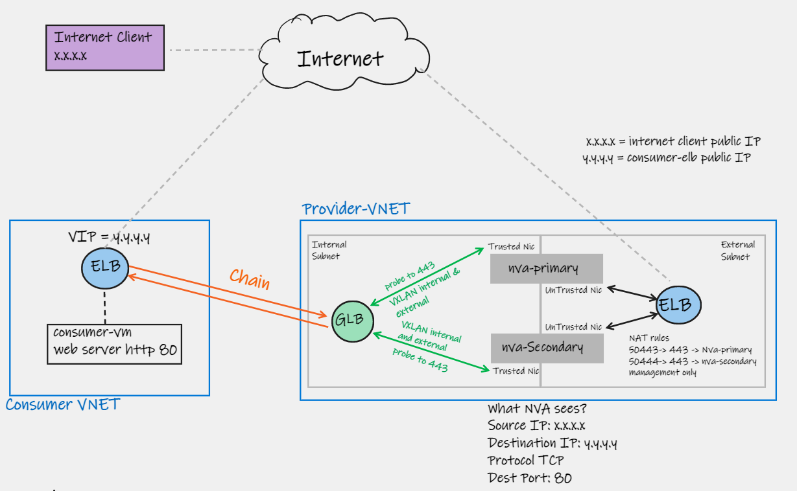
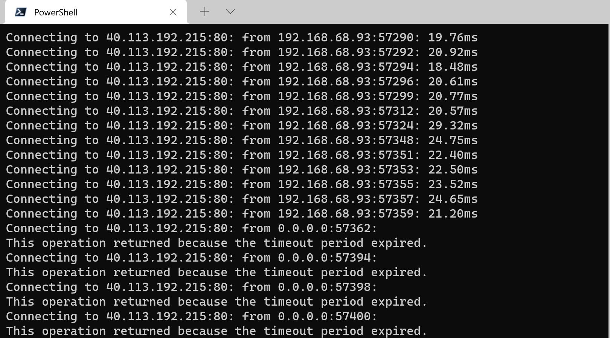
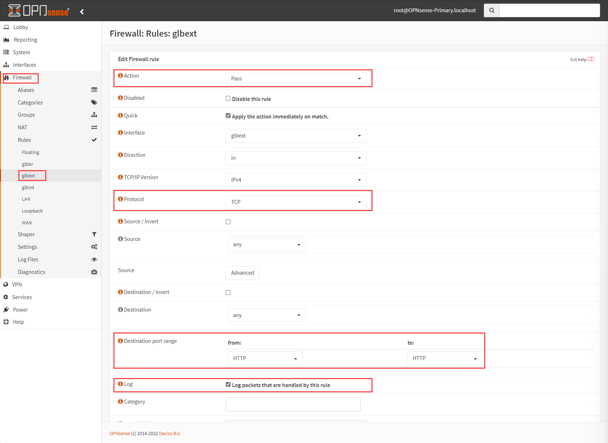

# Azure Gateway Load Balancer (Lab)

**In this article**

- [Introduction](#introduction)
- [Network diagram](#network-diagram)
    - [Components and traffic flow](#components-and-traffic-flow)
    - [Considerations](#considerations)
- [ARM Template](#arm-template)
- [Deploy this solution](#deploy-this-solution)
    - [Prerequisites](#prerequisites)
    - [Consumer](#consumer)
    - [Provider](#provider)
- [Traffic inspection](#traffic-inspection)

## Introduction

The goal of this lab is to allow you to play with Gateway Load Balancer (GLB) and some of its capabilities. We will also spend some time explaining the under the hood components such as VXLAN that make GLB promising by making the NVA placement easier to implement in some scenarios. 

As part of the lab provisioning, two environments will be created. One is the consumer, with a simple web application exposed over an external (public) load balancer, and another for the provider using an NVA, who will be responsible for the traffic inspection.

GLB will be using a pair of open-source OPNsense NVAs as its backend, and we will explore some basic filtering capabilities initially and other advanced capabilities like IDS.

**Note:** for more information on OPNsense provisioning in Azure, check a dedicated repo with some other deployments: [OPNSense in Azure using bootstrap](https://github.com/dmauser/opnazure)

We assume you some a basic knowledge of what GLB is, if below some references to bring you up to the speed on GLB:

- **Microsoft Docs:** [Gateway Load Balancer](https://docs.microsoft.com/en-us/azure/load-balancer/gateway-overview)
- **Azure Blog:** [Enhance third-party NVA availability with Azure Gateway Load Balancer—now in preview](https://azure.microsoft.com/en-us/blog/enhance-thirdparty-nva-availability-with-azure-gateway-load-balancer-now-in-preview/) - This article also goes over vendor-specific supportability for GLB
- **John Savill's video**: [Azure Gateway Load Balancer Deep Dive](https://www.youtube.com/watch?v=JLx7ZFzjdSs)
- **Jose Moreno's deep dive article:** [What language does the Azure Gateway Load Balancer speak?](https://blog.cloudtrooper.net/2021/11/11/what-language-does-the-azure-gateway-load-balancer-speak/)

## Lab Network diagram

The network diagram below gives you a visualization of the components involved in this lab:



### Components and traffic flow

#### Consumer side

- Consumer-vnet (/24) with two subnets: vmsubnet (/27), and AzureBastionSubnet (/27).
- Consumer-elb (External Public Load Balancer).
    - Load Balancer rule to TCP 80 (HTTP).
    - Probe to port 80.
    - Inbound NAT Rule 50000 to 22 (SSH) to access consumer-vm.
    - Backend Pool: consumer-vm.
- Consumer-vm running Ubuntu/NGINX (From internet client you can run: curl Consumer-elb Public IP and you should get output: _Test Website on consumer-vm_)
- Consumer-bastion (optional)

#### Provider side
- Provider-vnet (/24) with three subnets: external (/27), internal (/27), and AzureBastionSubnet (/27)
- Provider-nva-glb - Gateway Load Balancer with backend pool with traffic towards NVAs.
    - Load balancer :  HA Port (All/0).
    - Backend Pool to both Provider-nva-primary and Provider-nva-secondary.
        - Protocol: VLXAN 
        - Type: Internal/External
        - Internal port: 10800
        - Internal identifier: 800
        - External port: 10801
        - External identifier: 801
    - Health Probe: TCP 443.
- Provider-nva-elb - This is an external load balancer used only for management:
    - Inbound NAT rule: 50443 to 443 (Provider-nva-primary)
    - Inbound NAT rule: 50444 to 443 (Provider-nva-secondary)
- Provider-nva-primary
- Provider-nva-secondary
- Provider-bastion (optional)
- provider-win11 (optional)

#### Traffic flow

**Inbound traffic**

1) Internet client (1.1.1.1) issues a http request to 2.2.2.2
2) Consumer ELB intercepts that traffic and forwards it to the Provider GLB. That is possible because Consumer ELB has a chain to the Provider ELB. Example:

3) Provider GLB has a VXLAN overlay network to the NVA to be inspected. _Vxlan0 interface for the external traffic (Inbound from Internet)_.
4) After traffic gets inspected from NVA, traffic is sent back to the GLB. _Vxlan1 interface for the internal traffic_ (Outbound to the Consumer ELB).
5) Provider GLB sends traffic back to the Consumer ELB.
6) Consumer ELB delivers traffic back to the backend VM (consumer-vm).

**Outbound traffic**

1) Consumer-vm sends outbound traffic to the internet, for example: _curl ipconfig.io_
2) Consumer ELB intercepts the call and sends traffic to the Provider GLB.
3) Provider GLB sends traffic to the NVA using _vxlan1 (internal)_.
4) After traffic gets inspected by the NVA traffic sends it back to the Provider GLB using _vxlan0 (external)_.
5) Provider GLB sends traffic back to the ELB and traffic is send out to the Internet.

#### Inside VXLAN between GLB and backend NVA

Here are some details how that VXLAN overlay is built for internal and external traffic.


### Considerations

- Consumer and Provider can be in different Azure Subscriptions or tenants.
- At this time only External (Public) LB is supported to chain to the Gateway LB. Therefore, only North-South/South-North traffic patterns are supported.

## ARM Template

Before going over all the lab steps, it is important to share that you can deploy this solution in your environment by using an ARM Template available. This ARM Template assumes you have an existing Virtual Network (VNET) and at least two subnets: Untrusted (or External), and Trusted (or Internal).  However, it is recommended you go over the lab to understand better all the component involved and it will help you to succeed on the provisioning process.

[](https://portal.azure.com/#create/Microsoft.Template/uri/https%3A%2F%2Fraw.githubusercontent.com%2Fdmauser%2Fazure-gateway-lb%2Fmain%2FARM%2Fglb-active-active.json)
[](http://armviz.io/#/?load=https%3A%2F%2Fraw.githubusercontent.com%2Fdmauser%2Fazure-gateway-lb%2Fmain%2FARM%2Fglb-active-active.json)

Also review the [Considerations after provisioning provider NVAs:](#considerations-after-provisioning-provider-nvas) to properly access and managed provisioned NVAs.

## Deploy this solution

On this lab you are going to deploy to deploy Consumer and Provider in totally different networks. In this demonstration both networks use the same address range (10.0.0.0/24) to proof that on GLB model provider side, where the inspection is done, is totally separated from the consumer side from networking perspective (no VNET peerings between them). You can also provision both Consumer and Provider in the same Subscription or separated Subscription/Tenants.

:point_right: **Note:** the commands below use bash variables format. Therefore, run them either over Linux with Azure CLI or Azure Cloud Shell Bash. Variables will fail over AZ CLI in PowerShell or windows command prompt.

### Lab prerequisites

Azure CLI or Cloud Shell Bash can be used to deploy this solution.

```Bash
az login
#List all your subscriptions
az account list -o table --query "[].{Name:name, IsDefault:isDefault}"
#List default Subscription being used
az account list --query "[?isDefault == \`true\`].{Name:name, IsDefault:isDefault}" -o table

# In case you want to do it separated Subscription change your active subscription as shown
az account set --subscription <Add your Subscription Name or ID>  # Change as needed
```

### Consumer

Define variables based on your requirements

```bash
consumer_rg=glb-lab
consumer_location=centralus
consumervnetcidr="10.0.0.0/24"
consumersubnet="10.0.0.0/27"
consumerbastionsubnet="10.0.0.32/27"
mypip=$(curl -4 ifconfig.io -s) # or replace with your home public ip, example mypip="1.1.1.1" (required for Cloud Shell deployments)
echo "Type username and password"
read -p 'Username: ' username && read -sp 'Password: ' password 
```

Run Steps below from 1 to 6 or 7 (Bastion is optional):

```bash
# 1) Create Consumer VNET and subnet
az group create --name $consumer_rg --location $consumer_location --output none
az network vnet create --resource-group $consumer_rg --name consumer-vnet --location $consumer_location --address-prefixes $consumervnetcidr --subnet-name vmsubnet --subnet-prefix $consumersubnet --output none

# 2) UDR to restrict SSH access to Azure VMs from your Public IP only:
az network nsg create --resource-group $consumer_rg --name consumer-nsg --location $consumer_location
az network nsg rule create \
    --resource-group $consumer_rg \
    --nsg-name consumer-nsg \
    --name AllowSSHRule \
    --direction Inbound \
    --priority 100 \
    --source-address-prefixes $mypip/32 \
    --source-port-ranges '*' \
    --destination-address-prefixes '*' \
    --destination-port-ranges 22 \
    --access Allow \
    --protocol Tcp \
    --description "Allow inbound SSH" \
    --output none
az network nsg rule create \
    --resource-group $consumer_rg \
    --nsg-name consumer-nsg \
    --name allow-http \
    --direction Inbound \
    --priority  101 \
    --source-address-prefixes '*' \
    --source-port-ranges '*' \
    --destination-address-prefixes '*' \
    --destination-port-ranges 80 \
    --access Allow \
    --protocol Tcp \
    --description "Allow inbound HTTP" \
    --output none
az network vnet subnet update --name vmsubnet --resource-group $consumer_rg --vnet-name consumer-vnet --network-security-group consumer-nsg --output none

# 3) Create Public Load Balancer
az network lb create -g $consumer_rg --name consumer-elb --sku Standard --frontend-ip-name frontendip1 --backend-pool-name vmbackend --output none
az network lb probe create -g $consumer_rg --lb-name consumer-elb --name httpprobe --protocol tcp --port 80 --output none
az network lb rule create -g $consumer_rg --lb-name consumer-elb --name http-lb-rule --protocol TCP --frontend-ip-name frontendip1 --backend-pool-name vmbackend --probe-name httpprobe --frontend-port 80 --backend-port 80 --output none
az network lb inbound-nat-rule create -g $consumer_rg --lb-name consumer-elb -n sshnat --protocol Tcp --frontend-port 50000 --backend-port 22

# 4) Deploy Azure VM with NGX using a simple test Website
az network nic create --resource-group $consumer_rg -n consumer-vm-nic --location $consumer_location --subnet vmsubnet --vnet-name consumer-vnet --output none
az vm create -n consumer-vm -g $consumer_rg --image UbuntuLTS --size Standard_B1s --admin-username $username --admin-password $password --nics consumer-vm-nic --no-wait --location $consumer_location --output none

# ) Attach VM to LB Rule and NAT Rule
az network nic ip-config address-pool add --address-pool vmbackend --ip-config-name ipconfig1 --nic-name consumer-vm-nic --resource-group $consumer_rg --lb-name consumer-elb --output none
az network nic ip-config inbound-nat-rule add --inbound-nat-rule sshnat --ip-config-name ipconfig1 --nic-name consumer-vm-nic --resource-group $consumer_rg --lb-name consumer-elb --output none

# 6) Install nginx and test website (Move this to cloud.init)
az vm extension set --resource-group $consumer_rg --vm-name consumer-vm --name CustomScript --settings '{"commandToExecute": "apt-get -y update && apt-get -y install nginx && echo Test Website on consumer-vm > /var/www/html/index.html"}' --publisher Microsoft.Azure.Extensions --no-wait

# 7) Deploy Bastion (Optional)
az network vnet subnet create --resource-group $consumer_rg --name AzureBastionSubnet --vnet-name consumer-vnet --address-prefixes $consumerbastionsubnet --output none
az network public-ip create --resource-group $consumer_rg --name consumer-bastion-pip --sku Standard --location $consumer_location
az network bastion create --name consumer-bastion --sku basic  --public-ip-address consumer-bastion-pip --resource-group $consumer_rg --vnet-name consumer-vnet --location $consumer_location
```

### Provider

You can provision both Consumer and Provider in the same Subscription. In case you want to do it separated Subscription change your active subscription as shown:

```bash
az login
#List all your subscriptions
az account list -o table --query "[].{Name:name, IsDefault:isDefault}"
#List default Subscription being used
az account list --query "[?isDefault == \`true\`].{Name:name, IsDefault:isDefault}" -o table
az account set --subscription <Add your Subscription Name or ID>  # Change as needed
```

Set variables and make changes based on your needs.

```bash
provider_rg=glb-lab
provider_location=centralus
providervnetcidr="10.0.0.0/24"
providerexternalcidr="10.0.0.0/27"
providerinternalcidr="10.0.0.32/27"
providerbastionsubnet="10.0.0.64/27"
nva=provider-nva
mypip=$(curl -4 ifconfig.io -s) # or replace with your home public ip, example mypip="1.1.1.1" (required for Cloud Shell deployments)
```

Run Steps 1 and 2. Step 3 deploys Bastion and it is optional:

```bash
# 1) Create provider VNET and Internal/External 
az group create --name $provider_rg --location $provider_location --output none
az network vnet create --resource-group $provider_rg --name provider-vnet --location $provider_location --address-prefixes $providervnetcidr --subnet-name external --subnet-prefix $providerexternalcidr --output none
az network vnet subnet create --name internal --resource-group $provider_rg --vnet-name provider-vnet --address-prefix $providerinternalcidr --output none

# 2) Deploy both OPNsense NVA (work on this)
az deployment group create --name $nva-deploy-$RANDOM --resource-group $provider_rg \
--template-uri "https://raw.githubusercontent.com/dmauser/azure-gateway-lb/main/bicep/glb-active-active.json" \
--parameters virtualMachineSize=Standard_B2s virtualMachineName=$nva TempUsername=azureuser TempPassword=Msft123Msft123 existingVirtualNetworkName=provider-vnet existingUntrustedSubnet=external existingTrustedSubnet=internal PublicIPAddressSku=Standard \
--no-wait

# 3) Deploy Bastion (Optional) - You can access OPNSense by SSH via Bastion to perform troubleshooting.
az network vnet subnet create --resource-group $provider_rg --name AzureBastionSubnet --vnet-name provider-vnet --address-prefixes $providerbastionsubnet --output none
az network public-ip create --resource-group $provider_rg --name provider-bastion-pip --sku Standard --location $provider_location --output none
az network bastion create --name provider-bastion --sku basic  --public-ip-address provider-bastion-pip --resource-group $provider_rg --vnet-name provider-vnet --location $provider_location
```

#### Considerations after provisioning provider NVAs:

1. Password specified above is only used during deployment.
2. After the deployment completes, you can access OPNsense by using provider-nva-elb Public IP on port 50443 (first instance), 50444 (secondary instance). Although is recommended to manage primary instance and sync configuration with the secondary NVA (see item 4)
    ```bash
    # Get provider-nva-elb Public IP to manage both instances
    az network public-ip show -g $provider_rg --name provider-nva-elb-pip --query ipAddress -o tsv
    ```
3. It is recommended you manage only primary and synchronize configuration with secondary.
4. Default username is: **root** and default password is: **opnsense** (**Please change the password**).
    - Because the deployment is made in HA (primary and secondary) NVAs, make sure to change the HA Configuration Synchronization Settings password too.
    

### Validate Deployment

#### Test connectivity to consumer-vm via its ELB

After deployment is ready you dont have the traffic going to the provider yet. You need to chain the consumer-elb to the provider-nva-glb (instruction included on the next section).

To make sure everything is fine you can run the following commands to test the connectivity. You can use the following tools:

```bash
# Subscription where Consumer is (required only if consumer is on different subscription)
az account set --subscription <consumer subscription>  # Change to your subscription name

# Get consumer-elb public ip as variable.
consumerelbpip=$(az network public-ip show -g $consumer_rg --name PublicIPconsumer-elb --query ipAddress -o tsv)
echo $consumerelbpip

# Use the output below to run your connectivity tests. 
#Tests on Windows 
echo psping -t $consumerelbpip:80 
echo psping -t $consumerelbpip:50000
# Run output on windows command line.

# Use Linux (it requires nmap and hping3 packages)
sudo hping3 $consumerelbpip -S -p 50000
sudo nping --tcp $consumerelbpip -p 80 -c 50000
nc -v -z $consumerelbpip 80
# output: Connection to 40.113.192.215 80 port [tcp/http] succeeded!
curl $consumerelbpip
# output: Test Website on consumer-vm
```

#### Build a chain between consumer-elb and provider-nva-glb

It is recommended to leave one of the connectivity tests above while chaining the consumer-elb to the provider-nva-glb.

Commands below work for consumer and provider in same or different subscriptions (Portal only works for the same subscription):

```bash
# Check current sub
az account list --query "[?isDefault == \`true\`].{Name:name, IsDefault:isDefault}" -o table
# Subscription where Provider (required only if provider is on different subscription)
az account set --subscription <provider subscription>  # Change to your subscription name
# Set Gateway Load Balancer (provider-nva-glb) frontend name resource ID as variable 
glbfeid=$(az network lb frontend-ip show -g $provider_rg --lb-name provider-nva-glb --name FW --query id --output tsv)
echo $glbfeid

# Subscription where Consumer is (required only if consumer is on different subscription)
az account set --subscription <consumer subscription>  # Change to your subscription name
# Add chain between consumer-elb and provider-nva-glb
az network lb frontend-ip update -g $consumer_rg --name frontendip1 --lb-name consumer-elb --public-ip-address PublicIPconsumer-elb --gateway-lb $glbfeid --output none

# Validate chain between consumer-elb and provider-nva-glb
az network lb frontend-ip show -g $consumer_rg --name frontendip1 --lb-name consumer-elb --query gatewayLoadBalancer.id -o tsv
# In case you see a resource ID it there's a chain between consumer-elb and provider-nva-glb.
# Otherwise, empty output means there's no chain.

# Remove chain between consumer-elb and provider-nva-glb
az network lb frontend-ip update -g $consumer_rg --name frontendip1 --lb-name consumer-elb --public-ip-address PublicIPconsumer-elb --gateway-lb "" --output none
```

On the process above by adding the chain between consumer-elb and provider-nva-glb your running connectivity test should stop because there's no Firewall rule to allow traffic on the NVA. You should see a transition to disconnection as shown:



## Traffic inspection

### Layer 4 (Firewall)

#### Inbound Traffic

1. Create a Firewall Rule to allow traffic traffic to the port 80. You can enable logging to also see that traffic over Firewall - Log Files - Live View.

2. Make sure to apply changes and synchorize with settings with provider-nva-secondary by clicking on System: High Availability: Status and click in sync. (Note: you can also shutdown one of the NVAs if you want to avoid sync every time when you make a change. You can resync later as well to commit the changes to the secondary).

3. Check the psping/nping/hping connectivity check against port 80. If you have a check for port 50000 it should still see failure.
4. Play with the firewall rules and check the logs.

#### Outbound Traffic

(coming soon)

### Intrusion detection (IDS)

(coming soon)

### Layer 7 (Inspection)

(coming soon)
